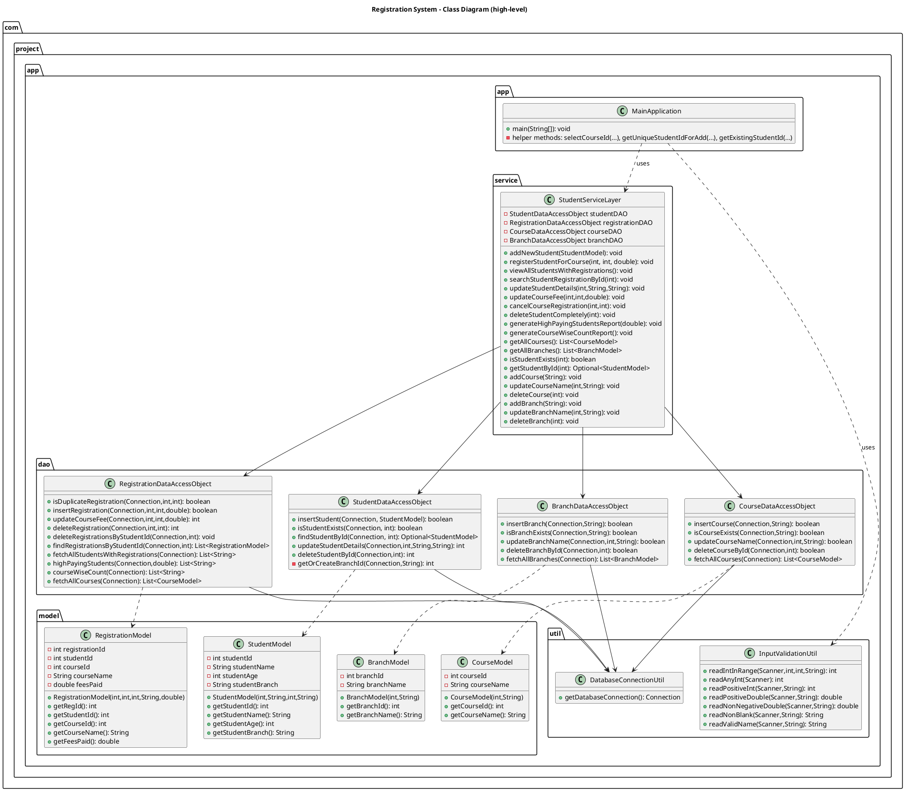
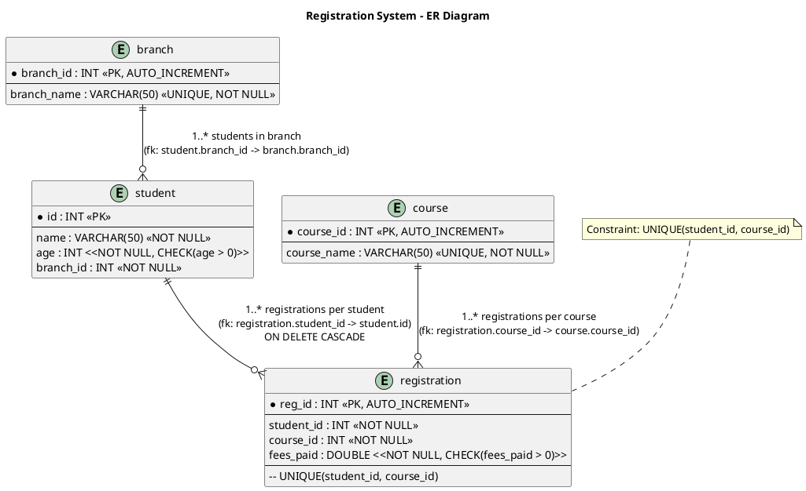

Registration System - Student Course Registration & Fee Management

Project Description
-------------------
This is a console-based Java application that manages students, courses, branches and registrations at a training institute. It follows a layered architecture:
- UI (MainApplication) — menu-driven console interface and immediate per-input validation.
- Service (StudentServiceLayer) — business logic, validation that needs DB checks, and transaction management for critical operations.
- DAO (JDBC) — data access objects that use PreparedStatement and try-with-resources.
- Database — MySQL schema with tables: branch, course, student, registration.

Key features
- Add / update / delete students
- Register students for courses (transactional; prevents duplicate registrations)
- Update course fees and cancel registrations
- Add / update / delete courses and branches
- View reports: all students with registrations, high-paying students, course-wise counts
- Input validation on each field (non-empty, name format, positive numbers, etc.)
- Safe DB operations (PreparedStatement, transactions where required)

Project structure (important files)
- src/com/project/app/app/MainApplication.java — console UI and menu
- src/com/project/app/service/StudentServiceLayer.java — business logic and transactions
- src/com/project/app/dao/StudentDataAccessObject.java — student DAO
- src/com/project/app/dao/RegistrationDataAccessObject.java — registration DAO
- src/com/project/app/dao/CourseDataAccessObject.java — course DAO
- src/com/project/app/dao/BranchDataAccessObject.java — branch DAO
- src/com/project/app/model/*Model.java — POJOs for Student, Registration, Course, Branch
- src/com/project/app/util/DatabaseConnectionUtil.java — DB connection helper
- src/com/project/app/util/InputValidationUtil.java — centralized input and validation helpers

Database schema (MySQL)
-----------------------
Use the following DDL to create the schema (database name: registration_system):

```sql
CREATE DATABASE IF NOT EXISTS registration_system;
USE registration_system;

CREATE TABLE branch (
    branch_id INT AUTO_INCREMENT PRIMARY KEY,
    branch_name VARCHAR(50) UNIQUE NOT NULL
);

CREATE TABLE course (
    course_id INT AUTO_INCREMENT PRIMARY KEY,
    course_name VARCHAR(50) UNIQUE NOT NULL
);

CREATE TABLE student (
    id INT PRIMARY KEY,
    name VARCHAR(50) NOT NULL,
    age INT NOT NULL CHECK (age > 0),
    branch_id INT NOT NULL,
    CONSTRAINT fk_student_branch FOREIGN KEY (branch_id) REFERENCES branch(branch_id)
);

CREATE TABLE registration (
    reg_id INT AUTO_INCREMENT PRIMARY KEY,
    student_id INT NOT NULL,
    course_id INT NOT NULL,
    fees_paid DOUBLE NOT NULL CHECK (fees_paid > 0),
    CONSTRAINT fk_registration_student FOREIGN KEY (student_id) REFERENCES student(id) ON DELETE CASCADE,
    CONSTRAINT fk_registration_course FOREIGN KEY (course_id) REFERENCES course(course_id),
    CONSTRAINT uq_student_course UNIQUE (student_id, course_id)
);
```

Seed example (optional)
```sql
INSERT INTO branch (branch_name) VALUES ('Computer Science'), ('Information Technology')
  ON DUPLICATE KEY UPDATE branch_name = branch_name;

INSERT INTO course (course_name) VALUES ('Java'), ('Python'), ('Data Science')
  ON DUPLICATE KEY UPDATE course_name = course_name;
```

How to build & run (local)
--------------------------
1. Ensure JDK is installed and `javac`/`java` are on PATH.
2. Add MySQL JDBC connector JAR to your classpath when running.
3. Compile:

```powershell
# from project root (Windows PowerShell)
New-Item -ItemType Directory -Force -Path out | Out-Null
Get-ChildItem -Path "src" -Recurse -Filter *.java | ForEach-Object { $_.FullName } | %{ & javac -d out $_ }
```

4. Run with the JDBC driver on the classpath:

```powershell
java -cp "out;C:\path\to\mysql-connector-java.jar" com.project.app.app.MainApplication
```

Notes
- Update DB credentials in `src/com/project/app/util/DatabaseConnectionUtil.java`.
- The application expects the database `registration_system` to exist and be reachable.

UML Class Diagram (PlantUML)
----------------------------
Paste this into a PlantUML editor or save as `class_diagram.puml` and render.



ER Diagram (PlantUML)
---------------------
Paste into PlantUML or save as `er_diagram.puml`.




