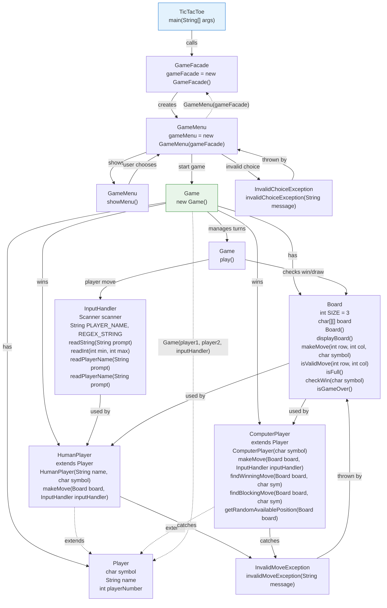

#  Tic-tac-toe Using Facade

A beginner-friendly Java console game that uses the **Facade Design Pattern** to keep the application simple to start, easy to understand, and easy to maintain. The game supports:

-  Human vs Human
-  Human vs Computer
-  Different board sizes

This project is a great example of how a small game can still be organized in a clean, professional way using object-oriented design.

---

##  Project Overview

The main purpose of this project is to show how a game can be split into small, focused parts instead of putting everything into one large class.

Each part of the project has a specific job:
- one part starts the application
- one part handles the menu and setup
- one part runs the game
- one part manages the board
- one part handles input
- one part represents players
- one part handles invalid actions safely

That separation makes the project easier to read, easier to test, and easier to extend later.

---

##  How It Works

Here is the high-level flow of the application:

1. The program starts from the main entry point.
2. The facade opens the game in a simple way.
3. The menu asks the user to choose the game mode.
4. The user selects the board size and enters player names.
5. The game begins and players take turns.
6. The board checks for valid moves, wins, and draws.
7. After the match, the user can replay, return to the menu, or exit.

This flow keeps the user experience simple and interactive while the internal classes handle the details behind the scenes.

---

##  Project Components

Below is a simple breakdown of the main parts of the project and what each one does.

### 1) `TicTacToeApp`
**Purpose:**
- This is the starting point of the whole application.

**Responsibilities:**
- Launch the game
- Pass control to the facade

**How it interacts:**
- It does not manage game logic directly
- It only begins the flow by calling the facade

---

### 2) `GameFacade`
**Purpose:**
- This is the main entry point for the user-facing part of the system.

**Responsibilities:**
- Hide the internal setup of the game
- Provide one simple way to start the application
- Keep the startup process clean and easy

**How it interacts:**
- It delegates work to `GameMenu`
- It acts as the front door of the application

---

### 3) `GameMenu`
**Purpose:**
- This class manages the user menu and game setup.

**Responsibilities:**
- Show the game options
- Read the user’s selection
- Ask for board size
- Ask for player names
- Create the correct type of game
- Handle replay, main menu, and exit choices after a match

**How it interacts:**
- It uses `InputHandler` for safe input
- It creates `Game` objects
- It connects the menu layer with the gameplay layer

---

### 4) `Game`
**Purpose:**
- This class controls the actual match.

**Responsibilities:**
- Run the turn-by-turn game flow
- Switch between players
- Check whether someone has won
- Check whether the game is a draw
- End the match at the right time

**How it interacts:**
- It uses `Board` to manage the game state
- It uses `Player` objects to get each move
- It relies on `InputHandler` when player input is needed

---

### 5) `Board`
**Purpose:**
- This class stores and manages the game board.

**Responsibilities:**
- Keep track of player moves
- Show the board to the user
- Check whether a move is valid
- Detect winning lines
- Detect a full board
- Support undoing a move when needed for AI checking

**How it interacts:**
- It is used by `Game` during every turn
- It is used by `HumanPlayer` and `ComputerPlayer` to place moves
- It supports move validation and win checking for the whole system

---

### 6) `InputHandler`
**Purpose:**
- This class handles all user input in one place.

**Responsibilities:**
- Read numeric input
- Make sure numbers are valid when required
- Validate player names
- Keep input errors out of the rest of the code

**How it interacts:**
- It is used by `GameMenu` and `HumanPlayer`
- It keeps the input process clean and user-friendly

---

### 7) `Player`
**Purpose:**
- This is the shared base role for every player in the game.

**Responsibilities:**
- Define what a player is
- Provide a common structure for all player types
- Allow the game to work with different player implementations in the same way

**How it interacts:**
- `Game` works with `Player` instead of depending on only one concrete player type
- `HumanPlayer` and `ComputerPlayer` both follow this shared role

---

### 8) `HumanPlayer`
**Purpose:**
- Represents a real person playing the game.

**Responsibilities:**
- Ask the user for a move
- Send the move to the board
- Handle invalid move attempts gracefully

**How it interacts:**
- It uses `InputHandler` to get the move
- It uses `Board` to place the symbol on the chosen cell
- It fits naturally into the same game flow as the computer player

---

### 9) `ComputerPlayer`
**Purpose:**
- Represents the computer opponent.

**Responsibilities:**
- Choose a move automatically
- Try to win when possible
- Block the human player when needed
- Pick another valid move if no immediate win or block is available

**How it interacts:**
- It uses `Board` to inspect available positions
- It temporarily tests board states when looking for good moves
- It follows the same `Player` role as the human player

---

### 10) `InvalidChoiceException`
**Purpose:**
- Represents an invalid menu selection.

**Responsibilities:**
- Help the program respond cleanly when the user chooses an invalid option
- Keep menu validation easy to understand

**How it interacts:**
- It is used by `GameMenu` when the selected option is not allowed

---

### 11) `InvalidMoveException`
**Purpose:**
- Represents an invalid board move.

**Responsibilities:**
- Stop illegal moves from being applied
- Protect the board from invalid state changes

**How it interacts:**
- It is used by `Board` when a move is out of range or already occupied
- It helps `HumanPlayer` and other game logic respond safely to invalid actions

---

##  Class Diagram

The diagram below is embedded directly in the README using Mermaid, so no separate image file is required.

### What the diagram shows

The diagram gives a visual map of the project. It helps explain how the classes work together:

- **Inheritance**: `HumanPlayer` and `ComputerPlayer` are both special kinds of `Player`
- **Composition / Ownership**: `GameFacade` owns the menu flow and `Game` works with the board during a match
- **Dependency**: several classes depend on input, board state, or player behavior to do their work
- **Association**: the menu, game, and players cooperate to complete a full match

### Why the design makes sense

This structure makes the project feel organized and natural:

- the user sees one simple entry point
- the menu handles setup instead of the whole app doing it
- the game logic stays separate from input handling
- player behavior stays separate from board logic
- validation and exceptions keep the app safe and stable

That is exactly the kind of design the Facade pattern is meant to support.

---

##  Design Pattern: Facade

The **Facade Design Pattern** is the main design pattern used in this project.

### What the Facade does here

The facade gives the application a simple front-facing entry point. Instead of forcing the user or the main program to deal with all the internal setup, the facade hides that complexity and coordinates everything behind the scenes.

### Which class acts as the facade?

The main facade is `GameFacade`.

### Why `GameFacade` is the facade

- It provides a simple way to start the application
- It hides the internal menu and setup details
- It keeps the startup process small and readable
- It protects the user from needing to know how the full system is wired together

### How this simplifies the system

With the facade in place:
- the main program stays tiny
- the game is easier to launch
- the internal classes can change without affecting the outside entry point
- the project becomes easier to understand for beginners

### Extra coordination layer

`GameMenu` also plays an important supporting role by coordinating the menu, game creation, and replay flow. This keeps the responsibilities well separated while still making the user experience smooth.

---

##  SOLID Principles

This project also follows the **SOLID principles**, which help keep the code clean and flexible.

### 1. Single Responsibility Principle
Each class has one clear job.

**Conceptual example:**
- the board manages the board
- the menu manages choices
- the game manages turns
- the input handler manages user input

This makes the project easier to maintain because each part has a clear purpose.

### 2. Open/Closed Principle
The system is designed so it can grow without major rewrites.

**Conceptual example:**
- new player types can be added later
- new game behavior can be introduced without rebuilding the entire app

This helps the project stay flexible over time.

### 3. Liskov Substitution Principle
Different player types can be used in the same game flow.

**Conceptual example:**
- a human player and a computer player both behave like a player
- the game does not need special treatment for each one

That means one type can replace another without breaking the design.

### 4. Interface Segregation Principle
Classes only depend on the behavior they actually need.

**Conceptual example:**
- the game does not force input behavior onto every class
- the system keeps responsibilities focused and practical

This prevents unnecessary complexity.

### 5. Dependency Inversion Principle
High-level parts of the system rely on shared roles and helper components rather than tightly depending on one fixed implementation.

**Conceptual example:**
- the game works with the idea of a player, not only one specific player class
- input handling is passed in where needed instead of being hardwired everywhere

This makes the project easier to test, extend, and reuse.

### How SOLID supports the Facade design

SOLID and Facade work well together in this project because:
- the facade keeps the entry point simple
- SOLID keeps each supporting class focused
- the result is a clean system that is easy to understand and expand

---

##  Why This Design Works Well

This design is a strong fit for a small game because it keeps things simple without making the code messy.

### Benefits
- easy for beginners to follow
- clear separation of responsibilities
- simple game startup through one facade
- better reuse of player, board, and input logic
- easier to add features later
- more readable class structure

---

##  User Experience

This project is meant to feel interactive and friendly.

The user can:
- choose a game mode
- set the board size
- enter names
- play a full match
- replay the game
- return to the menu
- exit cleanly

If something invalid is entered, the application responds with a helpful message instead of crashing.

---

##  Summary

This Tic-tac-toe project is a great example of how to build a simple game with a clean architecture.

It shows how the **Facade pattern** can make a program easier to use, while **SOLID principles** make the internal design easier to maintain and extend.

The result is a project that is:
- beginner-friendly
- professional in structure
- interactive for users
- easy to explain from the class diagram
- ready for future improvements

