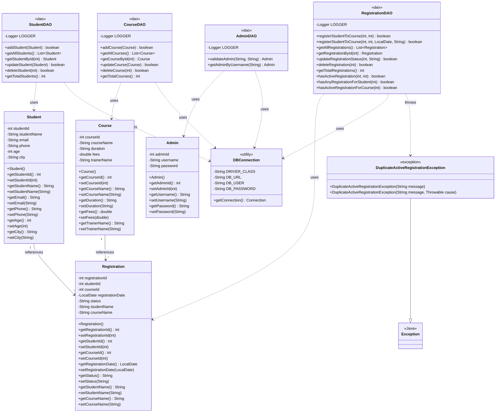

# Student Course Registration & Management System

A Java Servlet-based web application for managing students, courses, and course registrations.

## Project Overview

This is a mini project demonstrating practical use of:
- Servlet fundamentals and lifecycle methods with logging
- Sessions and cookies
- RequestDispatcher and sendRedirect
- JDBC database connection with proper error handling
- CRUD operations
- JSP pages
- HTML and CSS
- Comprehensive business rule enforcement

## Technologies Used

- **Frontend:** HTML, CSS, JSP
- **Backend:** Java Servlets (Jakarta EE API)
- **Server:** Apache Tomcat 10.x
- **Database:** MySQL 8.0+ (supports ENUM and generated columns)
- **Database Connectivity:** JDBC with PreparedStatement
- **Build Tool:** Maven
- **Logging:** java.util.logging

## Project Structure

```
src/main/java/com/studentcourse/
├── controller/              # 18 Servlet controllers
│   ├── LoginServlet.java
│   ├── LoginPageServlet.java
│   ├── LogoutServlet.java
│   ├── DashboardServlet.java
│   ├── AddStudentServlet.java
│   ├── ViewStudentsServlet.java
│   ├── EditStudentServlet.java
│   ├── UpdateStudentServlet.java
│   ├── DeleteStudentServlet.java
│   ├── AddCourseServlet.java
│   ├── ViewCoursesServlet.java
│   ├── EditCourseServlet.java
│   ├── UpdateCourseServlet.java
│   ├── DeleteCourseServlet.java
│   ├── RegistrationFormServlet.java
│   ├── RegisterStudentCourseServlet.java
│   ├── UpdateRegistrationStatusServlet.java
│   ├── DeleteRegistrationServlet.java
│   └── ViewRegistrationsServlet.java
│
├── dao/                     # Data Access Objects
│   ├── AdminDAO.java
│   ├── StudentDAO.java
│   ├── CourseDAO.java
│   └── RegistrationDAO.java
│
├── model/                   # Entity classes
│   ├── Admin.java
│   ├── Student.java
│   ├── Course.java
│   └── Registration.java
│
├── exception/               # Custom exceptions
│   └── DuplicateActiveRegistrationException.java
│
└── util/                    # Utility classes
    └── DBConnection.java

src/main/webapp/
├── index.html
├── css/
│   └── style.css
└── WEB-INF/
    ├── views/
    │   ├── login.jsp
    │   ├── dashboard.jsp
    │   ├── student-form.jsp
    │   ├── student-list.jsp
    │   ├── update-student.jsp
    │   ├── course-form.jsp
    │   ├── course-list.jsp
    │   ├── update-course.jsp
    │   ├── registration-form.jsp
    │   ├── registration-list.jsp
    │   └── error.jsp
    └── web.xml

src/main/resources/
└── schema.sql
```

## Class Diagram



## Setup Instructions

### 1. Database Setup

Execute these SQL commands in your MySQL client:

```sql
CREATE DATABASE IF NOT EXISTS student_course_db;
USE student_course_db;

CREATE TABLE admin (
    admin_id INT AUTO_INCREMENT PRIMARY KEY,
    username VARCHAR(50) NOT NULL UNIQUE,
    password VARCHAR(100) NOT NULL
);

CREATE TABLE students (
    student_id INT AUTO_INCREMENT PRIMARY KEY,
    student_name VARCHAR(100) NOT NULL,
    email VARCHAR(100) NOT NULL,
    phone VARCHAR(15) NOT NULL,
    age INT NOT NULL,
    city VARCHAR(50) NOT NULL
);

CREATE TABLE courses (
    course_id INT AUTO_INCREMENT PRIMARY KEY,
    course_name VARCHAR(100) NOT NULL,
    duration VARCHAR(50) NOT NULL,
    fees DOUBLE NOT NULL,
    trainer_name VARCHAR(100) NOT NULL
);

CREATE TABLE registrations (
    registration_id INT AUTO_INCREMENT PRIMARY KEY,
    student_id INT NOT NULL,
    course_id INT NOT NULL,
    registration_date DATE NOT NULL,
    status ENUM('Active','Completed','Cancelled') NOT NULL,
    active_flag TINYINT(1) AS (status = 'Active') STORED,
    CONSTRAINT fk_reg_student FOREIGN KEY (student_id) REFERENCES students(student_id) ON DELETE RESTRICT ON UPDATE CASCADE,
    CONSTRAINT fk_reg_course FOREIGN KEY (course_id) REFERENCES courses(course_id) ON DELETE RESTRICT ON UPDATE CASCADE,
    CONSTRAINT uc_student_course_active UNIQUE (student_id, course_id, active_flag)
);

INSERT INTO admin (username, password) VALUES ('admin', 'admin123');

INSERT INTO students (student_name, email, phone, age, city) VALUES
('Alice Johnson', 'alice@example.com', '555-0101', 20, 'CityA'),
('Bob Smith', 'bob@example.com', '555-0102', 22, 'CityB'),
('Charlie Lee', 'charlie@example.com', '555-0103', 19, 'CityC');

INSERT INTO courses (course_name, duration, fees, trainer_name) VALUES
('Java Fundamentals', '8 weeks', 2500.00, 'Trainer A'),
('Web Development', '10 weeks', 3000.00, 'Trainer B'),
('Database Design', '6 weeks', 2000.00, 'Trainer C');

INSERT INTO registrations (student_id, course_id, registration_date, status) VALUES
(1, 1, '2024-09-01', 'Active'),
(2, 1, '2024-09-02', 'Active'),
(3, 2, '2024-09-03', 'Completed');
```

### 2. Configure Database Connection

Edit `src/main/java/com/studentcourse/util/DBConnection.java`:

```java
private static final String DB_URL = "jdbc:mysql://localhost:3306/student_course_db";
private static final String DB_USER = "root";
private static final String DB_PASSWORD = "Abhishek@1137";  // Update with your password
```

### 3. Build the Project

```bash
cd "E:\MonoJava\servlet mini project"
mvn clean package
```

### 4. Deploy to Tomcat

1. Copy `target/servlet_mini_project.war` to Tomcat's `webapps` folder
2. Start Tomcat
3. Access: `http://localhost:8080/servlet_mini_project`

## Features Implemented

### Admin Authentication
- ✅ Login with database credentials
- ✅ Session-based authentication (30 min timeout)
- ✅ Cookie-based "Remember Username" (7 days)
- ✅ Password never stored in cookies
- ✅ Session invalidation on logout

### Student Management
- ✅ Add new student with validation
- ✅ View all students
- ✅ Edit/update existing student
- ✅ Delete student (blocked if registrations exist)
- ✅ Validation: name, email, phone, age ≥18, city required

### Course Management
- ✅ Add new course with validation
- ✅ View all courses
- ✅ Edit/update existing course
- ✅ Delete course (blocked if active registrations exist)
- ✅ Validation: name, duration, fees >0, trainer name required

### Registration Management
- ✅ Register students to courses
- ✅ View all registrations with student & course names
- ✅ Update registration status (Active/Completed/Cancelled)
- ✅ Delete registration records
- ✅ Duplicate active registration prevention
- ✅ Registration date and status selection

### Dashboard
- ✅ Welcome message with admin username
- ✅ Total count of students
- ✅ Total count of courses
- ✅ Total count of registrations
- ✅ Quick links to all modules

## Key Concepts Demonstrated

### Servlet Lifecycle Methods

Four servlets demonstrate full lifecycle:

1. **LoginServlet** (`/login`)
   - init() → logs "LoginServlet initialized"
   - doGet() → displays login form
   - doPost() → processes authentication
   - destroy() → logs "LoginServlet destroyed"

2. **DashboardServlet** (`/dashboard`)
   - init() → logs "DashboardServlet initialized"
   - doGet() → loads dashboard data
   - destroy() → logs "DashboardServlet destroyed"

3. **AddStudentServlet** (`/addStudent`)
   - init() → logs "AddStudentServlet initialized"
   - doGet() → shows form
   - doPost() → processes student addition
   - destroy() → logs "AddStudentServlet destroyed"

4. **RegisterStudentCourseServlet** (`/registerStudentCourse`)
   - init() → logs "RegisterStudentCourseServlet initialized"
   - doPost() → processes registration
   - destroy() → logs "RegisterStudentCourseServlet destroyed"

**View Lifecycle Messages:**
- Run Tomcat in foreground: `catalina.bat run`
- Watch console output for init/doGet/doPost/destroy log messages
- Check `logs/catalina.out` for saved logs

### Sessions
- Created after successful login: `session.setAttribute("loggedInUser", username)`
- Protected pages: 14 servlets check session before processing
- Invalidated on logout: `session.invalidate()`
- Timeout: Tomcat default 30 minutes

### Cookies
- "Remember Username" checkbox creates 7-day cookie
- Cookie name: `rememberedUsername`
- Deleted when checkbox unchecked
- Password NEVER stored in cookies

### RequestDispatcher (Forward)
Used when request data must be preserved:
- Validation errors → forward back to form with error message
- Dashboard data → forward to JSP
- Student/course lists → forward to JSP
- Registration form → forward to JSP

### sendRedirect (Post-Redirect-Get)
Used after successful operations:
- Login success → redirect to dashboard
- Student/course/registration add → redirect to list
- Student/course/registration update → redirect to list
- Student/course/registration delete → redirect to list
- Logout → redirect to login

### JDBC & Database Operations
- PreparedStatement for SQL injection prevention
- Try-with-resources for connection management
- Proper error logging with java.util.logging.Logger
- DAO layer handles all SQL operations

## Business Rules Enforced

### Duplicate Active Registration Prevention
- DB Level: `UNIQUE (student_id, course_id, active_flag)` prevents DB insertion
- App Level: 
  - `RegistrationDAO.hasActiveRegistration()` checks before insert
  - `DuplicateActiveRegistrationException` thrown on DB violation
  - User-friendly error message shown in UI

### Student Deletion Protection
- DB Level: Foreign key with `ON DELETE RESTRICT`
- App Level: `RegistrationDAO.hasAnyRegistrationForStudent()` prevents deletion
- User sees: "Cannot delete student. Registrations exist for this student."

### Course Deletion Protection
- DB Level: Foreign key with `ON DELETE RESTRICT`
- App Level: `RegistrationDAO.hasActiveRegistrationForCourse()` prevents deletion
- User sees: "Cannot delete course. Active registrations exist for this course."

### Validation
- Server-side form validation on all inputs
- Age must be ≥ 18
- Fees must be > 0
- All required fields must be non-empty
- Status must be one of: Active/Completed/Cancelled

## Error Handling

### Logging
All DAOs use `java.util.logging.Logger` instead of printStackTrace():
```text
LOGGER.log(Level.SEVERE, "Database error description", exception);
```

### User-Friendly Messages
Specific error messages for:
- Duplicate active registration
- Blocked student deletion
- Blocked course deletion
- Invalid input data
- Database connection failures

### Exception Handling
- `DuplicateActiveRegistrationException` for duplicate registration scenarios
- SQL exceptions logged and mapped to user messages
- Input parsing exceptions handled gracefully

## Default Login Credentials

- **Username:** admin
- **Password:** admin123

## Usage Workflow

1. **Login:** Username `admin`, Password `admin123`
2. **Dashboard:** View statistics and navigate
3. **Student Management:** Add/view/edit/delete students
4. **Course Management:** Add/view/edit/delete courses
5. **Registrations:** Register students, view/update/delete registrations
6. **Logout:** Click logout to end session

## Testing Scenarios

### Test 1: Duplicate Registration Prevention
1. Register Student 1 to Course 1 with status Active
2. Try to register same student/course again → Error: "already actively registered"

### Test 2: Delete Protection
1. Try to delete Student 1 (has registrations) → Error: "Registrations exist"
2. Delete all registrations first, then delete student → Success

### Test 3: Session Protection
1. Delete session cookie or close browser
2. Try to access `/dashboard` directly → Redirected to login

### Test 4: Remember Username
1. Log in, check "Remember Username"
2. Close browser, reopen login page → Username pre-filled

## Security Features

- ✅ Session-based login (not cookie-based)
- ✅ Protected pages require session
- ✅ Password never stored in cookies
- ✅ JSP pages inside WEB-INF (not directly accessible)
- ✅ Input validation before database operation
- ✅ PreparedStatement prevents SQL injection
- ✅ HTTPS recommended for production

## Notes

- This is an educational mini project
- Passwords stored in plaintext (use bcrypt in production)
- DB credentials in source code (use environment variables in production)
- Single admin user (implement role-based access for production)
- No email verification (add for production)

## Troubleshooting

### Database Connection Error
- Verify MySQL is running
- Check credentials in DBConnection.java
- Verify database and tables exist
- Check MySQL JDBC driver compatibility

### Port 8080 Already in Use
- Change Tomcat port in `conf/server.xml`
- Or stop the application using port 8080

### Build Fails
- Run `mvn clean install` to download dependencies
- Verify JDK 11+ is installed
- Check Java_HOME environment variable

### Servlet Lifecycle Messages Not Showing
- Start Tomcat in foreground: `catalina.bat run`
- Ensure servlet filters don't suppress logging
- Check `logs/catalina.out` for messages

### Duplicate Registration Still Allowed
- Verify `registrations` table has the unique index created
- Check `active_flag` generated column was created
- Verify `status` is ENUM type

## Performance Improvements Made

- Connection pooling ready (can integrate HikariCP)
- PreparedStatement for prepared statement caching
- Logger instead of System.out for reduced overhead
- Database constraints reduce validation queries

## Future Enhancements

- Password hashing with bcrypt
- Email verification
- Role-based access control (Admin, Instructor, Student)
- API endpoints (REST)
- Pagination for large datasets
- Search and filter functionality
- Connection pooling
- Transaction management
- Unit and integration tests

---

**Version:** 2.0  
**Last Updated:** May 7, 2026  
**Java Version:** 11+  
**Jakarta EE Version:** 4.0+  
**MySQL Version:** 8.0+  
**Maven:** 3.6+  
**Tomcat:** 10.x
